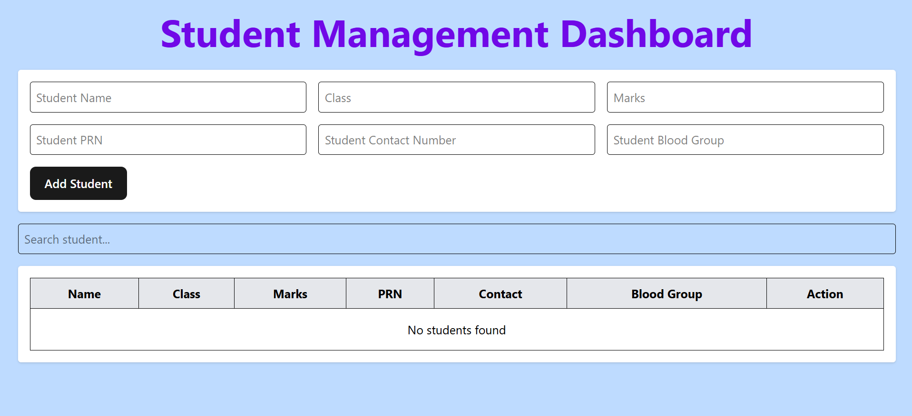
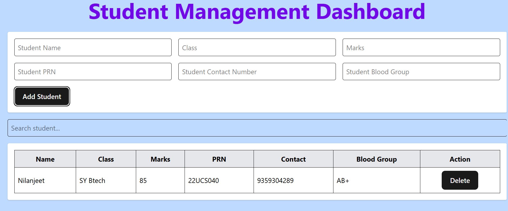
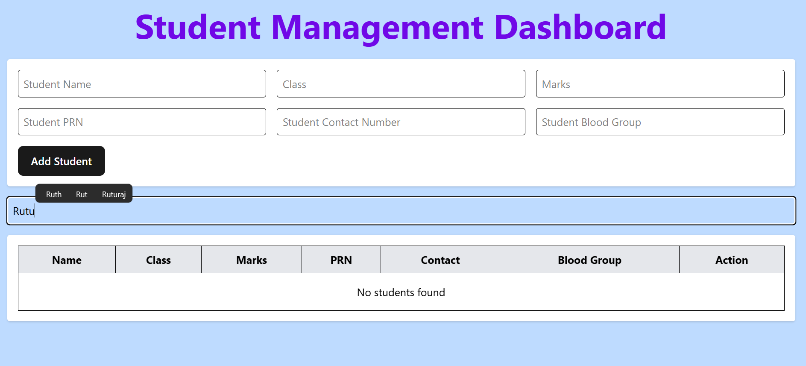
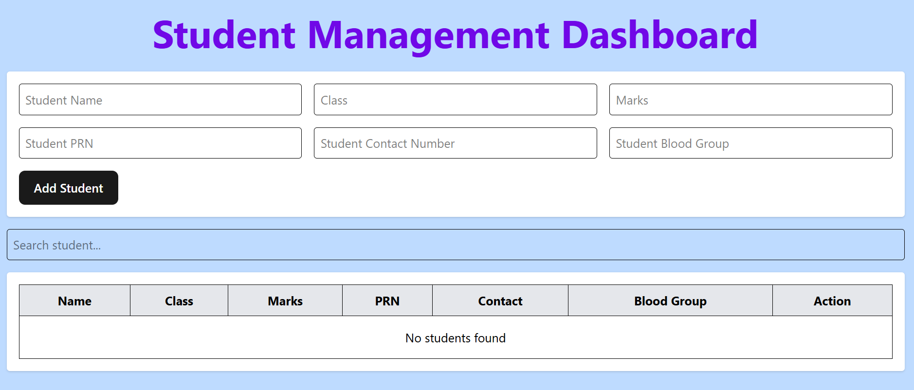

# Student Management Dashboard

A web application to manage student records efficiently.

## Features

* Add new students
* Dashboard
* Delete student records
* Search students

## Tech Stack

* React.js
* Vite
* JavaScript
* CSS

## Screenshots

## DashBoard



## Add_Student



## Search_Student



## Delete_Student



## Installation

```bash
git clone https://github.com/Nilanjeet18/Student-Management-Dashboard.git

cd Student-Management-Dashboard

npm install

npm run dev
```

## Future Improvements

* Authentication and Authorization
* Pagination
* Backend API Integration
* Export data to PDF or Excel
